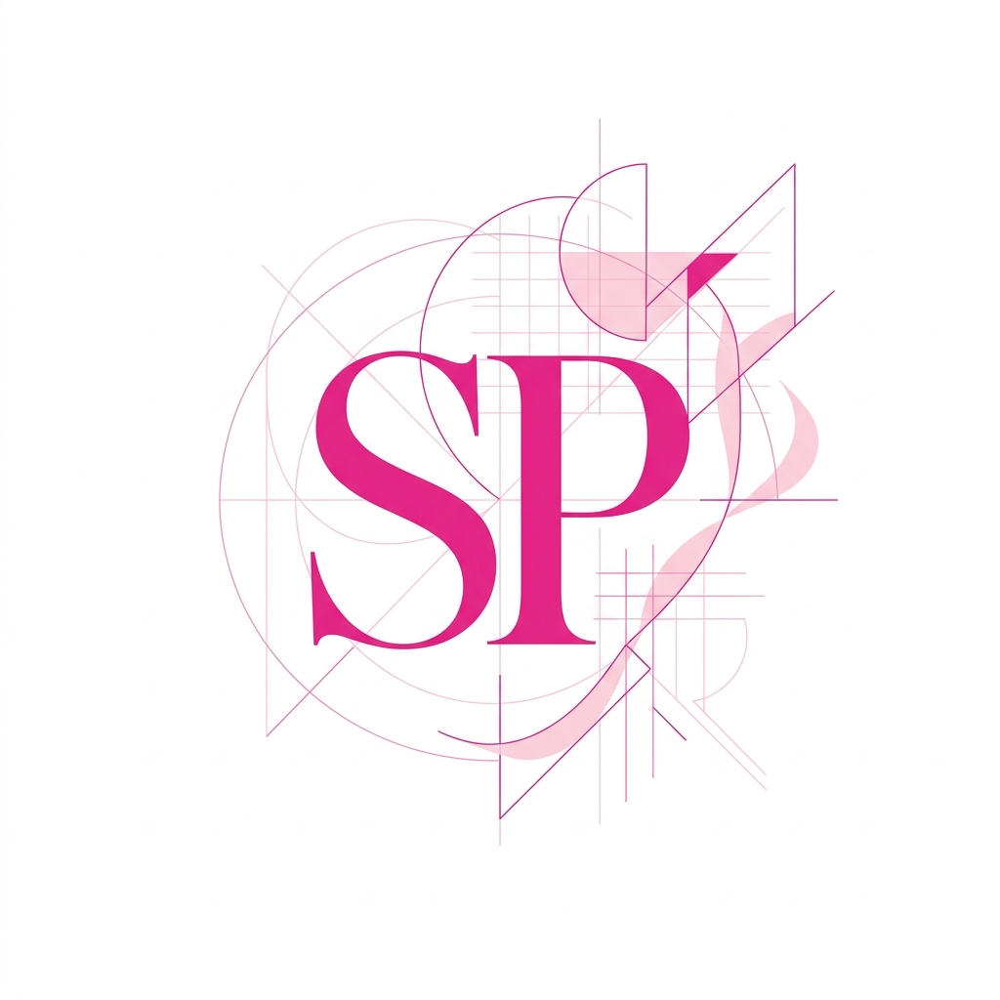

<!--
  SHAMBHAVI PATIL — GITHUB PROFILE README
  Barbiecore Editorial · Software + AI Engineering
  Design: Premium light palette, editorial typography, zero emojis
-->

<!-- ════════════════════════════════════════════════════ -->
<!-- 01 · HERO -->
<!-- ════════════════════════════════════════════════════ -->

 

SHAMBHAVI PATIL &nbsp;/&nbsp; SOFTWARE + AI

 

 

# Shambhavi Patil

<strong>AI/ML &nbsp;&nbsp;·&nbsp;&nbsp; Software Engineering &nbsp;&nbsp;·&nbsp;&nbsp; Intelligent Systems</strong>

Third-year ENTC student at PICT Pune building practical software and AI systems with real-world applications.

 

&nbsp;

&nbsp;

  

---

<!-- ════════════════════════════════════════════════════ -->
<!-- 02 · PROFILE SNAPSHOT -->
<!-- ════════════════════════════════════════════════════ -->

<table>
  <tr>
    <td align="center" width="220">
      <b>EDUCATION</b>  
      <b>PICT Pune</b> 
      B.Tech ENTC 
      2024 – 2028 
      CGPA &nbsp;<b>8.6 / 10</b>
    </td>
    <td align="center" width="30">&nbsp;</td>
    <td align="center" width="220">
      <b>CURRENT</b>  
      <b>Mindstrix Technologies</b> 
      AI/ML R&D Intern 
      Mar 2026 – Present 
      Pune, India
    </td>
    <td align="center" width="30">&nbsp;</td>
    <td align="center" width="220">
      <b>FOCUS</b>  
      AI / ML Systems 
      Software Engineering 
      Computer Vision 
      DSA &amp; Algorithms
    </td>
  </tr>
</table>

---

<!-- ════════════════════════════════════════════════════ -->
<!-- 03 · ABOUT -->
<!-- ════════════════════════════════════════════════════ -->

### About

Electronics and Telecommunication student at PICT Pune, actively building across software engineering, AI/ML research and data structures. My academic foundation in ENTC intersects with a deep interest in applied intelligence — I work on systems that are practical, technically grounded and oriented toward real-world impact.

My work spans AI-driven agriculture, quantitative reinforcement learning, multi-agent systems and computer vision. I bring these projects through hackathons, internships and independent research — from architecture to deployment.

 

> *I learn by building, breaking, debugging and improving real systems.*

---

<!-- ════════════════════════════════════════════════════ -->
<!-- 04 · WHAT I BUILD -->
<!-- ════════════════════════════════════════════════════ -->

### What I Build

<table width="100%">
  <tr>
    <td width="33%" valign="top">
      
<b>AI / ML</b>

      
Autonomous workflows, ML pipelines, predictive systems

      
<code>Python · ML · Multi-Agent</code>

    </td>
    <td width="33%" valign="top">
      
<b>Software Systems</b>

      
Full-stack engineering, REST APIs, distributed architectures

      
<code>Node.js · FastAPI · TypeScript</code>

    </td>
    <td width="33%" valign="top">
      
<b>Computer Vision</b>

      
OCR fraud detection, image processing, spatial feature extraction

      
<code>OpenCV · Python · Deep Learning</code>

    </td>
  </tr>
  <tr>
    <td width="33%" valign="top">
      
<b>Agritech</b>

      
Soil telemetry, crop health advisory, satellite canopy diagnostics

      
<code>Python · GIS · NDVI · Sensors</code>

    </td>
    <td width="33%" valign="top">
      
<b>Quant / RL</b>

      
Custom Gymnasium environments, order-book backtesting, RL policy

      
<code>Python · Gymnasium · Deep RL</code>

    </td>
    <td width="33%" valign="top">
      
<b>DSA &amp; Algorithms</b>

      
Competitive problem solving, algorithmic design, optimisation

      
<code>C++ · Java · Python</code>

    </td>
  </tr>
</table>

---

<!-- ════════════════════════════════════════════════════ -->
<!-- 05 · SELECTED WORK -->
<!-- ════════════════════════════════════════════════════ -->

### Selected Work

 

<!-- Featured Project -->
<table width="100%">
  <tr>
    <td valign="top">
      

        
        &nbsp;
        
      

      <h3><a href="https://github.com/Shambhavi500/KrishiSahAI">KrishiSahAI</a></h3>
      
AI-powered agriculture platform for crop recommendations, soil telemetry and rural decision support. Built to empower Indian farming ecosystems with intelligent advisory systems.

      

        
        
        
        
      

      
<a href="https://github.com/Shambhavi500/KrishiSahAI"><b>View Repository →</b></a>

    </td>
  </tr>
</table>

 

<!-- Secondary projects 02 + 03 -->
<table width="100%">
  <tr>
    <td width="50%" valign="top">
      

      <h4><a href="https://github.com/Shambhavi500/KRISHI-PRABANDH">KRISHI-PRABANDH</a></h4>
      
NATIONAL RUNNER-UP · PUNE AGRI HACKATHON

      
AI-driven agricultural governance platform combining OCR fraud detection, land record digitization and satellite NDVI validation. Presented to senior government officials. <b>₹15L development grant awarded.</b>

      

        
        
        
        
      

      
<a href="https://github.com/Shambhavi500/KRISHI-PRABANDH">View Repository →</a>

    </td>
    <td width="50%" valign="top">
      

      <h4><a href="https://github.com/Shambhavi500/AlphaTrader-RL">AlphaTrader-RL</a></h4>
      
QUANTITATIVE REINFORCEMENT LEARNING

      
Custom Gymnasium trading environment benchmarked on 5+ years of NSE order-book data. 50-dimensional state space with containerized execution and policy evaluation.

      

        
        
        
      

      
<a href="https://github.com/Shambhavi500/AlphaTrader-RL">View Repository →</a>

    </td>
  </tr>
</table>

 

<!-- Project 04 -->
<table width="100%">
  <tr>
    <td width="50%" valign="top">
      

      <h4><a href="https://github.com/Shambhavi500/Ovio">Ovio</a></h4>
      
MULTI-AGENT SYSTEMS

      
AI-assisted DaVinci Resolve workflow engine orchestrating timeline operations, asset synthesis and automated editorial cuts via multi-agent coordination.

      

        
        
        
      

      
<a href="https://github.com/Shambhavi500/Ovio">View Repository →</a>

    </td>
    <td width="50%"></td>
  </tr>
</table>

---

<!-- ════════════════════════════════════════════════════ -->
<!-- 06 · RECOGNITION -->
<!-- ════════════════════════════════════════════════════ -->

### Recognition

<table width="100%">
  <tr>
    <td width="50%" valign="top">
      
<b>01</b>

      <h4>TechFiesta 2026</h4>
      

      
Agriculture Domain &nbsp;·&nbsp; 600+ teams nationwide KrishiSahAI — end-to-end AI advisory and soil telemetry platform

    </td>
    <td width="50%" valign="top">
      
<b>02</b>

      <h4>Pune Agri International Hackathon</h4>
      

        
        &nbsp;
        
      

      
KRISHI-PRABANDH — OCR fraud detection + satellite NDVI validation Presented to senior government leadership

    </td>
  </tr>
</table>

---

<!-- ════════════════════════════════════════════════════ -->
<!-- 07 · EXPERIENCE -->
<!-- ════════════════════════════════════════════════════ -->

### Experience

<table width="100%">
  <tr>
    <td width="4" bgcolor="#E0218A">&nbsp;</td>
    <td width="16">&nbsp;</td>
    <td valign="top">
      

      
<b>Mindstrix Technologies LLP</b> 
      AI/ML Research &amp; Development Intern &nbsp;·&nbsp; Mar 2026 – Present

      
Contributing across the SDLC on live AI/ML and software platform projects. Designing and coding modules for data processing, model training and system integration. Working in an Agile team through technical reviews and cross-functional product development.

    </td>
  </tr>
</table>

 

<table width="100%">
  <tr>
    <td width="4" bgcolor="#FFD6E7">&nbsp;</td>
    <td width="16">&nbsp;</td>
    <td valign="top">
      

      
<b>Pune Institute of Computer Technology (PICT)</b> 
      B.Tech Electronics &amp; Telecommunication &nbsp;·&nbsp; 2024 – 2028

      
CGPA: <b>8.6 / 10</b> &nbsp;·&nbsp; HSC: 89.83% &nbsp;·&nbsp; SSC: 96.40% Signal processing · Communication systems · Embedded hardware · Algorithmic computation

    </td>
  </tr>
</table>

---

<!-- ════════════════════════════════════════════════════ -->
<!-- 08 · STACK -->
<!-- ════════════════════════════════════════════════════ -->

### Stack

 

<b>LANGUAGES</b>

  
  
  
  
  
  

<b>AI / INTELLIGENCE</b>

  
  
  
  

<b>ENGINEERING</b>

  
  
  
  
  
  

---

<!-- ════════════════════════════════════════════════════ -->
<!-- 09 · GITHUB ACTIVITY -->
<!-- ════════════════════════════════════════════════════ -->

### GitHub Activity

 

 

<table>
  <tr>
    <td>
      
    </td>
    <td>
      
    </td>
  </tr>
</table>

 

---

<!-- ════════════════════════════════════════════════════ -->
<!-- 10 · CURRENTLY BUILDING -->
<!-- ════════════════════════════════════════════════════ -->

 

<b>CURRENTLY BUILDING</b>

  

AI/ML systems &nbsp;&nbsp;·&nbsp;&nbsp; Autonomous workflows &nbsp;&nbsp;·&nbsp;&nbsp; Data structures &amp; algorithms &nbsp;&nbsp;·&nbsp;&nbsp; Production-oriented software

  

---

<!-- ════════════════════════════════════════════════════ -->
<!-- 11 · ENGINEERING STATEMENT -->
<!-- ════════════════════════════════════════════════════ -->

 

### *Building practical systems, one experiment at a time.*

 

---

<!-- ════════════════════════════════════════════════════ -->
<!-- 12 · CONNECT -->
<!-- ════════════════════════════════════════════════════ -->

 

LET'S CONNECT

 

Interested in AI/ML, software systems or building something meaningful?

  

&nbsp;&nbsp;

&nbsp;&nbsp;

  

<code>SHAMBHAVI PATIL / 500</code>

 

